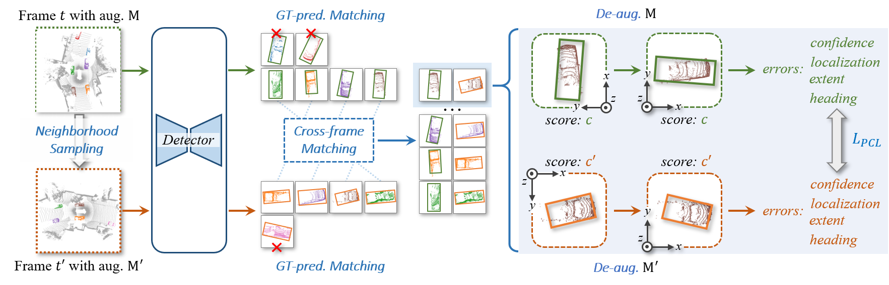
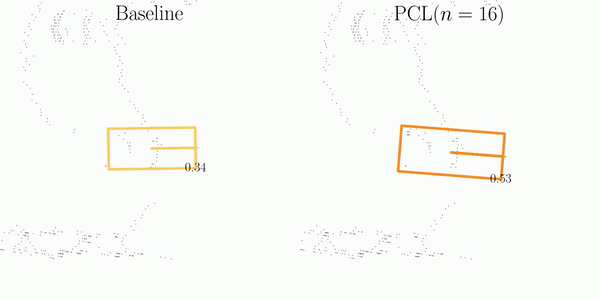
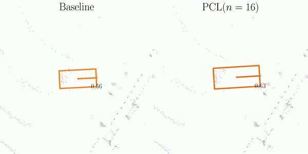
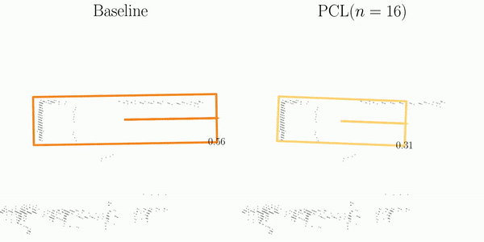
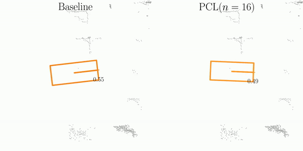

# Towards Stable 3D Object Detection

## Abstract

In autonomous driving, the temporal stability of 3D object detection greatly impacts the driving safety.
However, the detection stability cannot be accessed by existing metrics such as mAP and MOTA, and consequently is less explored by the community.
To bridge this gap, this work proposes **Stability Index (SI)**, a new metric that can comprehensively evaluate the stability of 3D detectors in terms of confidence, box localization, extent, and heading.
By benchmarking state-of-the-art object detectors on the Waymo Open Dataset, SI reveals interesting properties of object stability that have not been previously discovered by other metrics.
To help models improve their stability, we further introduce a general and effective training strategy, called **Prediction Consistency Learning (PCL)**.
PCL essentially encourages the prediction consistency of the same objects under different timestamps and augmentations, leading to enhanced detection stability. 
Furthermore, we examine the effectiveness of PCL with the widely-used CenterPoint, and achieve a remarkable SI of 86.00 for vehicle class, surpassing the baseline by 5.48.
We hope our work could serve as a reliable baseline and draw the community's attention to this crucial issue in 3D object detection.
Codes will be made publicly available.



## Demos
<table>
  <tr>
    <td align="center">Confidence</td>
    <td align="center">Localization</td>
  </tr>
  <tr>
    <td align="center"> 
      
    </td>
    <td align="center">
      
    </td>
  </tr>
  <tr>
    <td align="center">Extent</td>
    <td align="center">Heading</td>
  </tr>
  <tr>
    <td align="center">
      
    </td>
    <td align="center">
      
    </td>
  </tr>
</table>

## Main Results

We could not provide the above pretrained models due to [Waymo Dataset License Agreement](https://waymo.com/open/terms/), but you could easily achieve similar performance by training with the default configs.

<details>
<summary> Benckmark on Waymo Open Dataset </summary>
<table class="tg">
<thead>
  <tr>
    <th class="tg-vwo1" rowspan="2">Methods</th>
    <th class="tg-vwo1" colspan="6">Vehicle(%)</th>
    <th class="tg-vwo1" colspan="6">Pedestrain<span style="font-weight:400;font-style:normal">(%)</span></th>
    <th class="tg-vwo1" colspan="6">Cyclist<span style="font-weight:400;font-style:normal">(%)</span></th>
  </tr>
  <tr>
    <th class="tg-vwo1">mAPH_l1</th>
    <th class="tg-vwo1">SI</th>
    <th class="tg-vwo1">SI_c</th>
    <th class="tg-vwo1">SI_l</th>
    <th class="tg-vwo1">SI_e</th>
    <th class="tg-vwo1">SI_h</th>
    <th class="tg-vwo1">mAPH_l1</th>
    <th class="tg-vwo1">SI</th>
    <th class="tg-vwo1">SI_c</th>
    <th class="tg-vwo1">SI_l</th>
    <th class="tg-vwo1">SI_e</th>
    <th class="tg-vwo1">SI_h</th>
    <th class="tg-vwo1">mAPH_l1</th>
    <th class="tg-vwo1">SI</th>
    <th class="tg-vwo1">SI_c</th>
    <th class="tg-vwo1">SI_l</th>
    <th class="tg-vwo1">SI_e</th>
    <th class="tg-vwo1">SI_h</th>
  </tr>
</thead>
<tbody>
  <tr>
    <td class="tg-vwo1">Second</td>
    <td class="tg-48rl">72.60</td>
    <td class="tg-48rl">81.32</td>
    <td class="tg-48rl">90.17</td>
    <td class="tg-48rl">84.18</td>
    <td class="tg-48rl">91.95</td>
    <td class="tg-48rl">92.10</td>
    <td class="tg-48rl">59.81</td>
    <td class="tg-48rl">62.80</td>
    <td class="tg-48rl">83.94</td>
    <td class="tg-48rl">69.34</td>
    <td class="tg-48rl">87.30</td>
    <td class="tg-48rl">67.31</td>
    <td class="tg-48rl">61.95</td>
    <td class="tg-48rl">66.29</td>
    <td class="tg-48rl">81.94</td>
    <td class="tg-48rl">75.36</td>
    <td class="tg-48rl">85.99</td>
    <td class="tg-48rl">81.29</td>
  </tr>
  <tr>
    <td class="tg-vwo1">CenterPoint-Pillar</td>
    <td class="tg-48rl">72.44</td>
    <td class="tg-48rl">80.61</td>
    <td class="tg-48rl">89.03</td>
    <td class="tg-48rl">85.37</td>
    <td class="tg-48rl">91.00</td>
    <td class="tg-48rl">92.82</td>
    <td class="tg-48rl">65.59</td>
    <td class="tg-48rl">64.57</td>
    <td class="tg-48rl">83.24</td>
    <td class="tg-48rl">74.43</td>
    <td class="tg-48rl">87.38</td>
    <td class="tg-48rl">68.85</td>
    <td class="tg-48rl">67.36</td>
    <td class="tg-48rl">68.06</td>
    <td class="tg-48rl">80.77%</td>
    <td class="tg-48rl">77.66</td>
    <td class="tg-48rl">86.96</td>
    <td class="tg-48rl">85.89</td>
  </tr>
  <tr>
    <td class="tg-vwo1">PointPillar</td>
    <td class="tg-48rl">72.84</td>
    <td class="tg-48rl">80.84</td>
    <td class="tg-48rl">89.58</td>
    <td class="tg-48rl">84.40</td>
    <td class="tg-48rl">92.26</td>
    <td class="tg-48rl">91.60</td>
    <td class="tg-48rl">54.64</td>
    <td class="tg-48rl">62.03</td>
    <td class="tg-48rl">84.65</td>
    <td class="tg-48rl">72.08</td>
    <td class="tg-48rl">88.83</td>
    <td class="tg-48rl">57.93</td>
    <td class="tg-48rl">59.51</td>
    <td class="tg-48rl">66.14</td>
    <td class="tg-48rl">82.15%</td>
    <td class="tg-48rl">74.85</td>
    <td class="tg-48rl">88.00</td>
    <td class="tg-48rl">77.36</td>
  </tr>
  <tr>
    <td class="tg-vwo1">CenterPoint</td>
    <td class="tg-48rl">73.73</td>
    <td class="tg-48rl">80.52</td>
    <td class="tg-48rl">89.04</td>
    <td class="tg-48rl">85.33</td>
    <td class="tg-48rl">90.70</td>
    <td class="tg-48rl">92.88</td>
    <td class="tg-48rl">69.50</td>
    <td class="tg-48rl">68.40</td>
    <td class="tg-48rl">85.74</td>
    <td class="tg-48rl">73.28</td>
    <td class="tg-48rl">88.58</td>
    <td class="tg-48rl">74.95</td>
    <td class="tg-48rl">71.04</td>
    <td class="tg-48rl">68.40</td>
    <td class="tg-48rl">80.31%</td>
    <td class="tg-48rl">78.47</td>
    <td class="tg-48rl">87.37</td>
    <td class="tg-48rl">89.79</td>
  </tr>
  <tr>
    <td class="tg-vwo1">PartA2Net</td>
    <td class="tg-48rl">75.02</td>
    <td class="tg-48rl">82.86</td>
    <td class="tg-48rl">91.43</td>
    <td class="tg-48rl">85.38</td>
    <td class="tg-48rl">91.68</td>
    <td class="tg-48rl">91.69</td>
    <td class="tg-48rl">66.16</td>
    <td class="tg-48rl">65.08</td>
    <td class="tg-48rl">84.59</td>
    <td class="tg-48rl">73.61</td>
    <td class="tg-48rl">86.71</td>
    <td class="tg-48rl">67.04</td>
    <td class="tg-48rl">67.90</td>
    <td class="tg-48rl">72.73</td>
    <td class="tg-48rl">85.94%</td>
    <td class="tg-48rl">79.34</td>
    <td class="tg-48rl">86.97</td>
    <td class="tg-48rl">84.29</td>
  </tr>
  <tr>
    <td class="tg-vwo1">PV R-CNN</td>
    <td class="tg-48rl">75.92</td>
    <td class="tg-48rl">83.73</td>
    <td class="tg-48rl">91.94</td>
    <td class="tg-48rl">86.36</td>
    <td class="tg-48rl">92.30</td>
    <td class="tg-48rl">91.66</td>
    <td class="tg-48rl">66.28</td>
    <td class="tg-48rl">66.17</td>
    <td class="tg-48rl">86.02</td>
    <td class="tg-48rl">73.50</td>
    <td class="tg-48rl">87.39</td>
    <td class="tg-48rl">66.58</td>
    <td class="tg-48rl">68.38</td>
    <td class="tg-48rl">73.53</td>
    <td class="tg-48rl">86.84%</td>
    <td class="tg-48rl">78.86</td>
    <td class="tg-48rl">88.44</td>
    <td class="tg-48rl">83.22</td>
  </tr>
  <tr>
    <td class="tg-vwo1">Voxel R-CNN</td>
    <td class="tg-48rl">77.19</td>
    <td class="tg-48rl">84.26</td>
    <td class="tg-48rl">92.01</td>
    <td class="tg-48rl">86.66</td>
    <td class="tg-48rl">92.11</td>
    <td class="tg-48rl">93.33</td>
    <td class="tg-48rl">74.21</td>
    <td class="tg-48rl">69.50</td>
    <td class="tg-48rl">86.87</td>
    <td class="tg-48rl">75.33</td>
    <td class="tg-48rl">88.06</td>
    <td class="tg-48rl">73.56</td>
    <td class="tg-48rl">71.68</td>
    <td class="tg-48rl">73.23</td>
    <td class="tg-48rl">84.42%</td>
    <td class="tg-48rl">80.07</td>
    <td class="tg-48rl">87.67</td>
    <td class="tg-48rl">89.28</td>
  </tr>
  <tr>
    <td class="tg-vwo1">VoxelNeXt</td>
    <td class="tg-48rl">77.84</td>
    <td class="tg-48rl">84.82</td>
    <td class="tg-48rl">92.88</td>
    <td class="tg-48rl">86.28</td>
    <td class="tg-48rl">91.59</td>
    <td class="tg-48rl">94.17</td>
    <td class="tg-48rl">76.24</td>
    <td class="tg-48rl">74.74</td>
    <td class="tg-48rl">92.67</td>
    <td class="tg-48rl">75.65</td>
    <td class="tg-48rl">88.03</td>
    <td class="tg-48rl">75.80</td>
    <td class="tg-48rl">75.59</td>
    <td class="tg-48rl">76.48</td>
    <td class="tg-48rl">89.98%</td>
    <td class="tg-48rl">79.24</td>
    <td class="tg-48rl">84.90</td>
    <td class="tg-48rl">87.76</td>
  </tr>
  <tr>
    <td class="tg-vwo1">PV R-CNN++</td>
    <td class="tg-48rl">77.88</td>
    <td class="tg-48rl">84.49</td>
    <td class="tg-48rl">92.06</td>
    <td class="tg-48rl">87.22</td>
    <td class="tg-48rl">92.38</td>
    <td class="tg-48rl">93.18</td>
    <td class="tg-48rl">73.99</td>
    <td class="tg-48rl">69.27</td>
    <td class="tg-48rl">86.75</td>
    <td class="tg-48rl">75.27</td>
    <td class="tg-48rl">88.09</td>
    <td class="tg-48rl">73.24</td>
    <td class="tg-48rl">71.84</td>
    <td class="tg-48rl">73.05</td>
    <td class="tg-48rl">84.23%</td>
    <td class="tg-48rl">80.29</td>
    <td class="tg-48rl">87.66</td>
    <td class="tg-48rl">89.19</td>
  </tr>
  <tr>
    <td class="tg-vwo1">PV R-CNN++ Res</td>
    <td class="tg-48rl">78.33</td>
    <td class="tg-48rl">85.17</td>
    <td class="tg-48rl">92.47</td>
    <td class="tg-48rl">87.52</td>
    <td class="tg-48rl">92.51</td>
    <td class="tg-48rl">93.85</td>
    <td class="tg-48rl">75.75</td>
    <td class="tg-48rl">70.15</td>
    <td class="tg-48rl">87.16</td>
    <td class="tg-48rl">75.83</td>
    <td class="tg-48rl">87.89</td>
    <td class="tg-48rl">74.81</td>
    <td class="tg-48rl">72.47</td>
    <td class="tg-48rl">73.31</td>
    <td class="tg-48rl">84.25%</td>
    <td class="tg-48rl">80.61</td>
    <td class="tg-48rl">87.58</td>
    <td class="tg-48rl">89.65</td>
  </tr>
  <tr>
    <td class="tg-vwo1">DSVT</td>
    <td class="tg-48rl">78.82</td>
    <td class="tg-48rl">84.90</td>
    <td class="tg-48rl">92.51</td>
    <td class="tg-48rl">86.90</td>
    <td class="tg-48rl">91.53</td>
    <td class="tg-48rl">94.76</td>
    <td class="tg-48rl">76.81</td>
    <td class="tg-48rl">74.58</td>
    <td class="tg-48rl">91.88</td>
    <td class="tg-48rl">76.47</td>
    <td class="tg-48rl">88.71</td>
    <td class="tg-48rl">75.92</td>
    <td class="tg-48rl">75.44</td>
    <td class="tg-48rl">76.20</td>
    <td class="tg-48rl">88.22%</td>
    <td class="tg-48rl">80.48</td>
    <td class="tg-48rl">86.11</td>
    <td class="tg-48rl">89.88</td>
  </tr>
  <tr>
    <td class="tg-vwo1">TransFusion</td>
    <td class="tg-48rl">79.00</td>
    <td class="tg-48rl">82.32</td>
    <td class="tg-48rl">89.34</td>
    <td class="tg-48rl">86.8</td>
    <td class="tg-48rl">92.73</td>
    <td class="tg-48rl">95.68</td>
    <td class="tg-48rl">76.52</td>
    <td class="tg-48rl">69.11</td>
    <td class="tg-48rl">84.53</td>
    <td class="tg-48rl">75.39</td>
    <td class="tg-48rl">89.89</td>
    <td class="tg-48rl">78.78</td>
    <td class="tg-48rl">70.11</td>
    <td class="tg-48rl">70.35</td>
    <td class="tg-48rl">80.63%</td>
    <td class="tg-48rl">79.49</td>
    <td class="tg-48rl">90.56</td>
    <td class="tg-48rl">91.13</td>
  </tr>
</tbody>
</table>
</details>

<details>
<summary> Analysis on Waymo Open Dataset </summary>
<image src='docs/analysis.jpg'>
</details>


<details>
<summary> Results of PCL </summary>
<table class="tg">
<thead>
  <tr>
    <th class="tg-vwo1" rowspan="2">Methods</th>
    <th class="tg-vwo1" colspan="2">Vehicle(%)</th>
    <th class="tg-vwo1" colspan="2">Pedestrian(%)</th>
    <th class="tg-vwo1" colspan="2">Cyclist(%)</th>
  </tr>
  <tr>
    <th class="tg-vwo1">mAPH_l1</th>
    <th class="tg-vwo1">SI</th>
    <th class="tg-vwo1">mAPH_l1</th>
    <th class="tg-vwo1">SI</th>
    <th class="tg-vwo1">mAPH_l1</th>
    <th class="tg-vwo1">SI</th>
  </tr>
</thead>
<tbody>
  <tr>
    <td class="tg-vwo1"><a href="tools/cfgs/waymo_stable/centerpoint_baseline.yaml">Baseline</a></td>
    <td class="tg-vwo1">73.73</td>
    <td class="tg-vwo1">80.52</td>
    <td class="tg-vwo1">69.50</td>
    <td class="tg-vwo1">68.40</td>
    <td class="tg-vwo1">71.04</td>
    <td class="tg-vwo1">68.40</td>
  </tr>
  <tr>
    <td class="tg-vwo1"><a href="tools/cfgs/waymo_stable/centerpoint_finetune.yaml">w/o PCL</a></td>
    <td class="tg-vwo1">73.70</td>
    <td class="tg-vwo1">80.93</td>
    <td class="tg-vwo1">69.55</td>
    <td class="tg-vwo1">68.35</td>
    <td class="tg-vwo1">71.27</td>
    <td class="tg-vwo1">68.20</td>
  </tr>
  <tr>
    <td class="tg-vwo1"><a href="tools/cfgs/waymo_stable/centerpoint_PCL_n0.yaml">PCL (n=0)</a></td>
    <td class="tg-vwo1">75.57</td>
    <td class="tg-vwo1">85.42</td>
    <td class="tg-vwo1">70.18</td>
    <td class="tg-vwo1">71.87</td>
    <td class="tg-vwo1">70.86</td>
    <td class="tg-vwo1">68.80</td>
  </tr>
  <tr>
    <td class="tg-vwo1"><a href="tools/cfgs/waymo_stable/centerpoint_PCL_n4.yaml">PCL (n=4)</a></td>
    <td class="tg-vwo1">75.26</td>
    <td class="tg-vwo1">85.83</td>
    <td class="tg-vwo1">69.56</td>
    <td class="tg-vwo1">72.76</td>
    <td class="tg-vwo1">70.65</td>
    <td class="tg-vwo1">69.22</td>
  </tr>
  <tr>
    <td class="tg-vwo1"><a href="tools/cfgs/waymo_stable/centerpoint_PCL_n8.yaml">PCL (n=8)</a></td>
    <td class="tg-vwo1">75.04</td>
    <td class="tg-vwo1">85.94</td>
    <td class="tg-vwo1">68.82</td>
    <td class="tg-vwo1">72.87</td>
    <td class="tg-vwo1">70.31</td>
    <td class="tg-vwo1">69.32</td>
  </tr>
  <tr>
    <td class="tg-vwo1"><a href="tools/cfgs/waymo_stable/centerpoint_PCL_n12.yaml">PCL (n=12)</a></td>
    <td class="tg-vwo1">74.64</td>
    <td class="tg-vwo1">85.93</td>
    <td class="tg-vwo1">68.50</td>
    <td class="tg-vwo1">72.95</td>
    <td class="tg-vwo1">70.85</td>
    <td class="tg-vwo1">69.33</td>
  </tr>
  <tr>
    <td class="tg-vwo1"><a href="tools/cfgs/waymo_stable/centerpoint_PCL_n16.yaml">PCL (n=16)</a></td>
    <td class="tg-vwo1">74.54</td>
    <td class="tg-vwo1">86.00</td>
    <td class="tg-vwo1">67.82</td>
    <td class="tg-vwo1">73.14</td>
    <td class="tg-vwo1">70.25</td>
    <td class="tg-vwo1">69.16</td>
  </tr>
</tbody>
</table>
</details>

## Installation

Our *Stable Index* is implemented on the open source codebase [OpenPCDet](https://github.com/open-mmlab/OpenPCDet).
Please follow the guidence of the [INSTALL.md](https://github.com/open-mmlab/OpenPCDet/blob/master/docs/INSTALL.md) and [GETTING_STARTED.md](https://github.com/open-mmlab/OpenPCDet/blob/master/docs/GETTING_STARTED.md#waymo-open-dataset) in OpenPCDet for installation of this repo and data preparation of Waymo Open Dataset.

**Notification**: Here, we provide some important dependencies in [environment.txt](environments.txt) for the compatiblity of Tensorflow-2.5.
It's highly recommend using `pip install -r evironment.txt` before installation.

## Training and Evaluation

All configures using in our expeirments can be found in [waymo_stable](tools/cfgs/waymo_stable/).
Here, we introduce the steps to reproduce the results in our paper.

### Traning Baseline CenterPoint

The first step to re-implement PCL is training a baseline checkpoint of CenterPoint.
We provide the configure in [centerpoint_baselin.yaml](tools/cfgs/waymo_stable/centerpoint_baseline.yaml). You can train the baseline CenterPoint by:

```
cd tools
bash scripts/dist_train.sh 8 --cfg_file cfgs/waymo_stable/centerpoint_baseline.yaml
```

### Fine-tuning without or with PCL

We provide the confuigures of fine-tuning CenterPoint without PCL ([centerpoint_finetune.yaml](tools/cfgs/waymo_stable/centerpoint_finetune.yaml)) and with PCL ([centerpoint_PCL_n{X}.yaml](tools/cfgs/waymo_stable/centerpoint_PCL_n16.yaml)).
Here, `X` is the maximum interval between the neighborhood sampling, described in our paper.

Before traning, you need to first change the `PRETRAINED` arguemnt in configures to the path of the baseline checkpoint:
```
MODEL:
    NAME: CenterPoint
    # change this path to the baseline checkpoint.
    PRETRAINED: '../output/waymo_stable/centerpoint_baseline/default/ckpt/checkpoint_epoch_36.pth'
```

Then, you can finue-tune the baseline without or with PCL.

- Fine-tune without PCL:
```
cd tools
bash scripts/dist_train.sh 8 --cfg_file cfgs/waymo_stable/centerpoint_finetune.yaml
```

- Fine-tune with PCL
```
cd tools
bash scripts/dist_train.sh 8 --cfg_file cfgs/waymo_stable/centerpoint_PCL_n16.yaml
```


### Evaluation Stable Index

The stable index has been integrated in [waymo_dataset.py](pcdet/datasets/waymo/waymo_dataset.py).
You can evluate SI by adding 'stabe_index' to `POST_PROCESSING.EVAL_METRIC` in the configuration.

Taking [centerpoint_PCL_n16.yaml](tools/cfgs/waymo_stable/centerpoint_PCL_n16.yaml) for example, its configuration is written as:
```
POST_PROCESSING:
    RECALL_THRESH_LIST: [0.3, 0.5, 0.7]
    EVAL_METRIC: ['waymo', 'stable_index']
```

Then, you can evalute the mAPH and SI by runing:
```
cd tools
python test.py \
    --cfg_file cfgs/waymo_stable/centerpoint_PCL_n16.yaml \
    --ckpt ../output/waymo_stable/centerpoint_PCL_n16/default/ckpt/checkpoint_epoch_5.pth
```

If you has tested the model and got the `result.pkl` in `output`, you can directly evaluate stable index by:
```
python pcdet/datasets/waymo/waymo_stable_index.py \
    --gt_infos data/waymo/waymo_processed_data_v0_5_0_infos_val.pkl \
    --pred_infos output/waymo_stable/centerpoint_PCL_n16/default/eval/eval_with_train/epoch_5/result.pkl
```

## Acknowledgement

Our code is built on top of the open source codebase [OpenPCDet](https://github.com/open-mmlab/OpenPCDet). Thanks very much for their amazing works.
